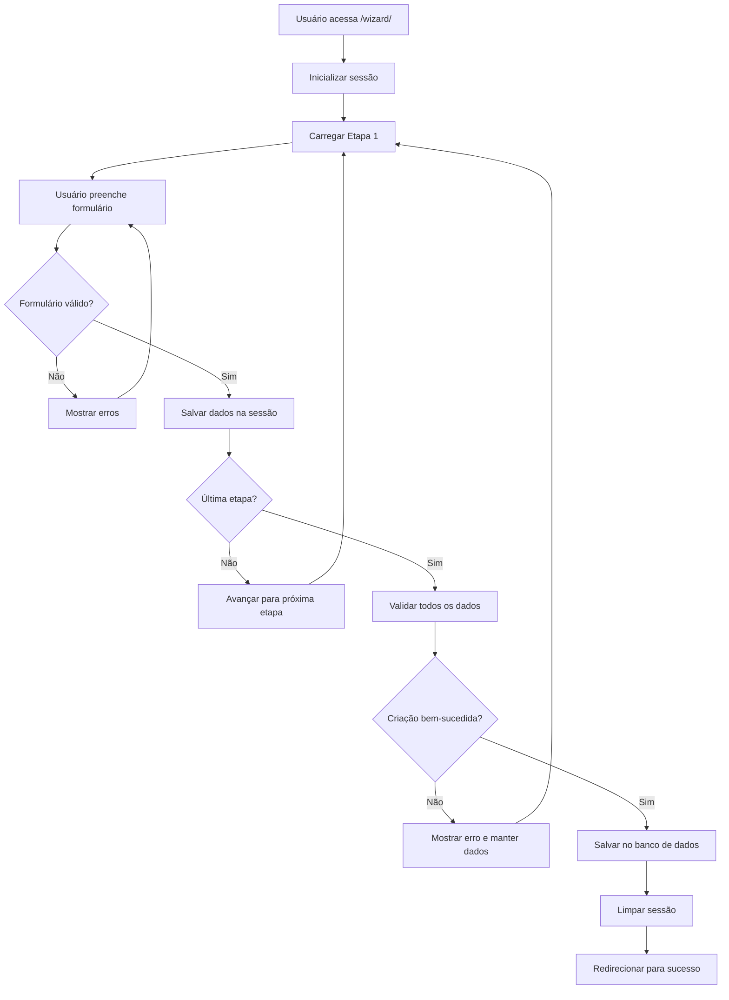

# Formulários Multi-Etapas no Django - Melhores Práticas

## Análise da Implementação Atual

### ❌ **Problemas da Implementação Atual:**

1. **Salvamento Prematuro**: Salvamos o objeto na Etapa 1, mas pode não estar completo
2. **Dependência de Sessão**: Se a sessão expirar, o usuário perde o progresso
3. **Falta de Validação Final**: Não validamos todos os dados antes de finalizar
4. **Gerenciamento de Estado**: Não temos controle sobre qual etapa o usuário pode acessar
5. **Dados Inconsistentes**: Objetos podem ficar em estado incompleto no banco

### ✅ **Implementação Recomendada (Wizard Pattern)**

## 1. **Padrão Wizard**

```python
class ExpedienteWizardView(LoginRequiredMixin, TemplateView):
    """
    Wizard para criação de expedientes em múltiplas etapas.
    Implementa o padrão Wizard seguindo as melhores práticas do Django.
    """
    STEPS = ['etapa1', 'etapa2', 'etapa3', 'etapa4']
    
    def dispatch(self, request, *args, **kwargs):
        # Inicializar dados do wizard na sessão
        if 'wizard_data' not in request.session:
            request.session['wizard_data'] = {}
            request.session['wizard_step'] = 0
        return super().dispatch(request, *args, **kwargs)
```

## 2. **Vantagens do Padrão Wizard**

### ✅ **Gerenciamento de Estado**
- **Dados temporários**: Armazenados na sessão até finalização
- **Navegação controlada**: Usuário só pode acessar etapas válidas
- **Validação por etapa**: Cada etapa valida seus próprios campos
- **Validação final**: Todos os dados são validados antes de salvar

### ✅ **Experiência do Usuário**
- **Progresso visual**: Barra de progresso e indicadores de etapas
- **Navegação flexível**: Pode voltar e avançar entre etapas
- **Dados preservados**: Informações não são perdidas entre etapas
- **Validação em tempo real**: Erros são mostrados imediatamente

### ✅ **Robustez**
- **Transações atômicas**: Objeto só é criado quando todos os dados estão válidos
- **Rollback automático**: Se houver erro, nada é salvo
- **Limpeza de sessão**: Dados temporários são limpos após finalização
- **Recuperação de erros**: Sistema pode recuperar de falhas

## 3. **Fluxo de Dados**



## 4. **Estrutura de Dados na Sessão**

```python
request.session = {
    'wizard_data': {
        'etapa1': {
            'numero_protocolo': '20250100001',
            'referencia': 'Ofício nº 123/2025',
            'tipo': 1,
            'origem': 'quiosque',
            'remetente': 'João Silva'
        },
        'etapa2': {
            'assunto': 'Solicitação de informações',
            'conteudo': 'Preciso de informações sobre...',
            'prioridade': 'normal',
            'data_limite': '2025-02-15'
        },
        'etapa3': {
            'sectores_envolvidos': [1, 2, 3],
            'membros_envolvidos': [5, 6, 7]
        },
        'etapa4': {
            'confirmacao': True
        }
    },
    'wizard_step': 2,
    'wizard_expediente_id': None  # Só é definido após finalização
}
```

## 5. **Validação e Segurança**

### ✅ **Validação por Etapa**
```python
def process_valid_form(self, form):
    """Processa um formulário válido"""
    current_step_name = self.get_current_step_name()
    wizard_data = self.request.session.get('wizard_data', {})
    
    # Salvar dados da etapa atual
    wizard_data[current_step_name] = form.cleaned_data
    self.request.session['wizard_data'] = wizard_data
```

### ✅ **Validação Final**
```python
def finish_wizard(self):
    """Finaliza o wizard criando o objeto final"""
    try:
        wizard_data = self.request.session.get('wizard_data', {})
        
        # Validar todos os dados antes de salvar
        if self.validate_all_data(wizard_data):
            expediente = self.create_expediente(wizard_data)
            self.clear_wizard_data()
            return redirect('entrada:detalhar_expediente', pk=expediente.id)
        else:
            messages.error(self.request, 'Dados inválidos.')
            return redirect('entrada:wizard')
    except Exception as e:
        messages.error(self.request, f'Erro: {str(e)}')
        return redirect('entrada:wizard')
```

## 6. **Alternativas e Bibliotecas**

### 📚 **Django Form Tools (Recomendado)**
```bash
pip install django-formtools
```

```python
from formtools.wizard.views import SessionWizardView

class ExpedienteWizard(SessionWizardView):
    form_list = [Etapa1Form, Etapa2Form, Etapa3Form, Etapa4Form]
    template_name = 'entrada/wizard.html'
    
    def done(self, form_list, **kwargs):
        # Processar todos os formulários
        expediente = self.create_expediente(form_list)
        return redirect('entrada:detalhar_expediente', pk=expediente.id)
```

### 📚 **Django Crispy Forms**
```bash
pip install django-crispy-forms
```

### 📚 **Django Widget Tweaks**
```bash
pip install django-widget-tweaks
```

## 7. **Comparação: Implementação Atual vs Recomendada**

| Aspecto | Implementação Atual | Implementação Recomendada |
|---------|-------------------|---------------------------|
| **Salvamento** | Na Etapa 1 | Só no final |
| **Validação** | Por etapa | Por etapa + final |
| **Navegação** | Linear | Flexível (voltar/avançar) |
| **Dados** | No banco | Na sessão |
| **Recuperação** | Difícil | Automática |
| **UX** | Básica | Rica (progresso, validação) |
| **Manutenção** | Complexa | Simples |
| **Testes** | Difíceis | Fáceis |

## 8. **Recomendações Finais**

### ✅ **Para o Projeto Atual:**
1. **Manter implementação atual** para compatibilidade
2. **Implementar wizard** como alternativa
3. **Migrar gradualmente** para o novo sistema
4. **Adicionar testes** para ambas as implementações

### ✅ **Para Novos Projetos:**
1. **Usar django-formtools** desde o início
2. **Implementar validação robusta**
3. **Adicionar testes abrangentes**
4. **Documentar fluxo de dados**

### ✅ **Melhorias Imediatas:**
1. **Adicionar validação final** na implementação atual
2. **Melhorar tratamento de erros**
3. **Adicionar logs de auditoria**
4. **Implementar timeout de sessão**

## 9. **Exemplo de Uso**

```python
# URLs
path('wizard/', wizard_views.ExpedienteWizardView.as_view(), name='wizard'),
path('wizard/<str:step>/', wizard_views.WizardStepView.as_view(), name='wizard_step'),

# Template
<a href="" class="btn btn-primary">
    <i class="bi bi-plus"></i> Nova Correspondência
</a>
```

## 10. **Conclusão**

A implementação atual **funciona**, mas não segue as melhores práticas. A implementação recomendada (Wizard Pattern) oferece:

- ✅ **Melhor UX**
- ✅ **Maior robustez**
- ✅ **Facilidade de manutenção**
- ✅ **Melhor testabilidade**
- ✅ **Padrão da indústria**

**Recomendação**: Implementar o wizard como alternativa e migrar gradualmente para o novo sistema.
